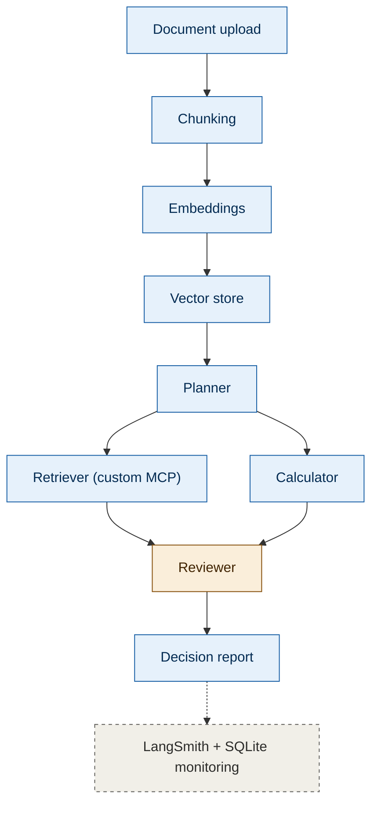

# ClauseGuard Architecture

See `assets/architecture.png` for the diagram this document describes.

ClauseGuard is structured as a pipeline, not a single prompt. A document moves through indexing, then through a multi-agent graph that ends in a Reviewer gate — no output reaches the user without passing through it.

## Pipeline

Monitoring (LangSmith tracing and structured SQLite logging) observes every node but sits outside the main flow — it doesn't gate or transform anything, it records. The Reviewer is highlighted separately because it's the one node that gates output rather than just transforming data.

## Nodes

**Document upload** — Entry point. Accepts a lease, insurance policy, or Terms of Service document, or a preloaded sample for demo purposes.

**Chunking** — Splits the document into retrievable segments. Chunking strategy (fixed-size vs. clause-boundary-aware) is an open engineering question tracked in `ROADMAP.md`; the version used here reflects whichever strategy the Phase 4 comparison determined performs better.

**Embeddings** — Converts each chunk into a vector representation for similarity search.

**Vector store** — Holds the embedded chunks for the current document. Scoped to a single document per session — ClauseGuard does not maintain a persistent cross-document knowledge base.

**Planner** — Decomposes the document into concern categories to check (fees, termination conditions, auto-renewal, liability, data use, and so on, depending on document type), and determines which downstream nodes are needed for each.

**Retriever (custom MCP server)** — Performs clause-level search against the vector store. Built as an original MCP server exposing a `clause_search` tool, rather than relying on a third-party retrieval server.

**Calculator** — Performs numeric computation on fee- and cost-related clauses (for example, total exposure from an escalating late fee, or comparing a flat fee against a per-day penalty). Its inclusion is conditional: if the clauses in the evaluation set don't require real computation beyond what the LLM already extracts, this node will be simplified or removed. That decision is tracked as an open question in `ROADMAP.md`.

**Reviewer** — The trust gate. Every claim produced by the Retriever and Calculator is checked against the actual source text before it can reach the output. A claim that cannot be traced to a real clause is rejected, not passed through with a caveat.

**Decision report** — The final output: categorized findings (concerning, neutral, favorable), each with a plain-language explanation and a citation to the source clause, plus a confidence-based note on when to consult a professional.

## Monitoring

LangSmith traces every node invocation — inputs, outputs, latency, and cost per step. A parallel SQLite log records the same information in structured form for querying outside LangSmith's interface. Neither system influences the pipeline's behavior; both exist purely for debugging and later evaluation.

## Open architectural questions

These are being resolved empirically, not assumed. See `ROADMAP.md` for full tracking.

- Does clause-boundary-aware chunking outperform fixed-size chunking on this document type?
- Does adding a reranking step after initial retrieval improve precision enough to justify the added latency?
- Does the Calculator node perform computation that couldn't be handled by the LLM directly, or is it redundant?
- Does the Reviewer gate measurably reduce unsupported claims compared to the same pipeline without it?
